# Microsoft 365 Usage Reports PowerShell Module <!-- omit in toc -->

- [Overview](#overview)
- [Requirements](#requirements)
- [How to Get the Script](#how-to-get-the-script)
- [The New-M365UsageReport Command](#the-new-m365usagereport-command)
  - [Syntax](#syntax)
  - [Parameters](#parameters)
- [Prerequisite Connection](#prerequisite-connection)
- [Example - Generate the 30-days usage report and send it by email](#example---generate-the-30-days-usage-report-and-send-it-by-email)
- [Example - Generate usage reports for selected workloads only](#example---generate-usage-reports-for-selected-workloads-only)
- [ANNEX](#annex)
  - [Register a New Azure AD App](#register-a-new-azure-ad-app)
    - [Adding the Required Microsoft Graph API Permissions](#adding-the-required-microsoft-graph-api-permissions)
    - [Adding the Required Exchange Online API Permissions](#adding-the-required-exchange-online-api-permissions)
    - [Creating and Uploading a Self-Signed Certificate](#creating-and-uploading-a-self-signed-certificate)
    - [Granting Admin Consent](#granting-admin-consent)
    - [Assigning the Exchange Administrator Role](#assigning-the-exchange-administrator-role)
  - [Sample Report](#sample-report)
    - [Email](#email)
    - [HTML File](#html-file)
    - [Raw Data CSV Files](#raw-data-csv-files)

## Overview

This PowerShell script exports the Microsoft 365 usage reports using the [*Microsoft Graph API*](https://docs.microsoft.com/en-us/graph/overview?view=graph-rest-1.0) and [*ExchangeOnlineManagement PowerShell Module*](https://www.powershellgallery.com/packages/ExchangeOnlineManagement). The results are saved locally and can also be sent by email.

The reports that can be exported using this script are:

- Assigned Licenses Report Count
  - Exchange
  - SharePoint
  - OneDrive
  - Skype for Business
  - Teams
  - Yammer
- Microsoft 365
  - Users
  - Activations
- Exchange Reports
  - Mailbox Status (Active/Inactive)
  - Mailbox Provisioning (Created/Deleted)
  - Mailbox Quota
  - Email App Usage
  - Office 365 Groups Provisioning
  - Mail Traffic (Inbound/Outbound)
  - Spam and Malware Detection (Count)
  - ATP Mail Detection (ATP Safe Links, ATP Safe Attachments)
  - Top 10 Mail Senders
  - Top 10 Mail Recipients
  - Top 10 Spam Recipients
  - Top 10 Malware Recipients
  - Top 10 Malware Detected
- SharePoint Reports
  - Total, Active, Inactive Sites
  - Storage Used (Tenant)
- OneDrive Reports
  - Total, Active, Inactive Sites
  - Storage Used (Tenant)
- Microsoft Teams
  - Total Users
  - Active Users
  - Inactive Users
  - Guest Users
  - Total 1:1 Calls
  - Total Channel Messages
  - Total Private Chat Messages
  - Total Meetings
  - Total Audio Duration (minutes)
  - Total Video Duration (minutes)
  - Total Screen Sharing Duration (minutes)
  - Device Usage Distribution

## Requirements

- A registered Azure AD (OAuth) App with the following settings:

  > Annex: [*Register a New Azure AD App*](#register-a-new-azure-ad-app)

  - **API**: *Microsoft Graph*
    - **Permission Type**: *Application*
    - **Permission(s)**:
      - `Reports.Read.All` - For reading the usage reports.
      - `Directory.Read.All` - For getting the deleted Microsoft 365 Groups and users.
      - `Mail.Send` - For sending the report by email.
  - **API**: *Office 365 Exchange Online*
    - **Permission Type**: *Application*
    - **Permission(s)**:
      - `Exchange.ManageAsApp` - Exchange Online app-only access.
- Windows PowerShell or PowerShell 7+.
- A new or existing Exchange Online mailbox to use as the report email sender. This can be a shared mailbox without a license.
- The [*ExchangeOnlineManagement PowerShell Module*](https://www.powershellgallery.com/packages/ExchangeOnlineManagement/)
- The [Microsoft Graph PowerShell Module](https://learn.microsoft.com/en-us/powershell/microsoftgraph/get-started?view=graph-powershell-1.0)

## How to Get the Script

[*Clone*](https://github.com/junecastillote/PS-Microsoft-365-Usage-Report.git) or [*download*](https://github.com/junecastillote/PS-Microsoft-365-Usage-Report/archive/refs/heads/main.zip) the script from the [*repository*](https://github.com/junecastillote/PS-Microsoft-365-Usage-Report). After downloading, extract the files to your preferred location.

## The New-M365UsageReport Command

This module contains several functions, but `New-M365UsageReport` is the main function to generate the report.

### Syntax

```PowerShell
New-M365UsageReport [[-ReportPeriod] [[-Scope] [[-Exclude] [[-From] [[-To] [[-Cc] [[-Bcc] [[-CustomEmailSubject] [-SendEmail] [-ShowReport] [<CommonParameters>]
```

### Parameters

The `New-M365UsageReport` function has these parameters.

- `-ReportPeriod` - Indicates the reporting period. Valid values are `7, 30, 90, 180`. If not used, the default value is `7`.
- `-Scope` - Specifies the scope of the report (which services/workloads). If not used, the report will include all available workload. This accepts multiple values. Valid values are:
  - `Microsoft365`
  - `Exchange`
  - `DefenderATP`
  - `SharePoint`
  - `OneDrive`
  - `Teams`
- `-Exclude` - Specifies which of the sub-reports to exclude. This is useful when you're testing or if there are certain items that you don't need in the report. This accepts multiple values. Valid values are:
  - `Microsoft365AssignedLicenses`
  - `Microsoft365ActiveUsers`
  - `Microsoft365ProductActivation`
  - `Microsoft365Groups`
  - `ExchangeMailboxUsageAndProvisioning`
  - `ExchangeClientAppUsage`
  - `ExchangeMailFlow`
  - `ExchangeTop10MailTraffic`
  - `DefenderATPDetections`
  - `SharePointUsageAndStorage`
  - `OneDriveUsageAndStorage`
  - `TeamsUsers`
  - `TeamsUsersActivities`
  - `TeamsDevices`
- `-SendEmail` - A switch parameter indicating to send the report via email.
  - `From` - Send email address. This is required if the `-SendEmail` switch is used.
  - `To` - One or more TO recipients. This is required if the `-SendEmail` switch is used.
  - `Cc` - One or more CC recipients. Optional.
  - `Bcc` - One or more BCC recipients. Optional.
- `-ShowReport` - This is a switch to indicate whether the report will be opened automatically in the web browser once generated. Use this only when running the report interactively.

## Prerequisite Connection

Before using this module, Microsoft Graph and Exchange Online PowerShell already be logged in using the registered application.

```PowerShell
# Define the connection parameter values
$clientId = 'client-id-here'
$tenantId = 'organization.onmicrosoft.com'
$certificateThumbprint = 'certificate-thumbprint-here'

# Connect to Microsoft Graph
Connect-MgGraph -TenantId $tenantId -ClientId $clientId -CertificateThumbprint $certificateThumbprint

# Connect to Exchange Online
Connect-ExchangeOnline -Organization $tenantId -AppId $clientId -CertificateThumbprint $certificateThumbprint -ShowBanner:$false
```

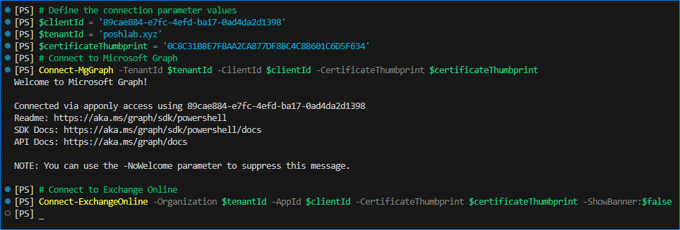

## Example - Generate the 30-days usage report and send it by email

```PowerShell

# Import the module
Import-Module .\PS.M365UsageReport.psd1

New-M365UsageReport `
    -ReportPeriod 30 `
    -SendEmail `
    -From 'Microsoft365UsageReports@contoso.com' `
    -To 'ReportAdmin@contoso.com', 'ReportGroup@contoso.com'
```

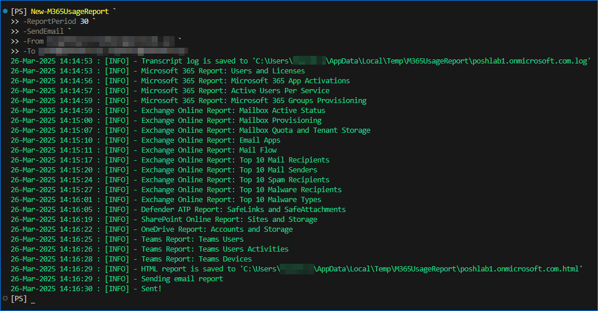

## Example - Generate usage reports for selected workloads only

This example shows how to generate the report for selected services or workloads only. For example, SharePoint Online and OneDrive for Business.

The `-ShowReport` switch will automatically open the HTML report in the default browser. This example will not send the report by email.

```PowerShell
Import-Module .\PS.M365UsageReport.psd1

New-M365UsageReport `
    -ReportPeriod 30 `
    -Scope SharePoint, OneDrive `
    -ShowReport
```

The output will be similar to this:

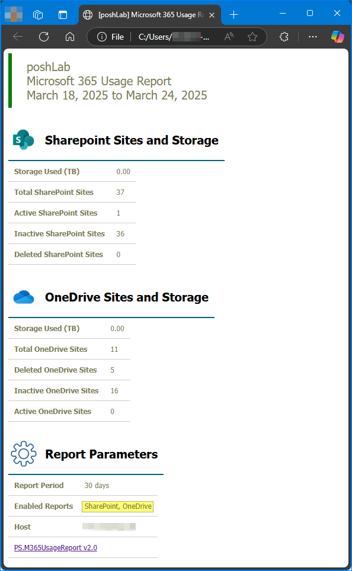

## ANNEX

### Register a New Azure AD App

Go to the [Azure Active Directory admin center](https://aad.portal.azure.com/) and navigate to ***Identity > Applications > App registrations***. Then, click on **New Registration**.

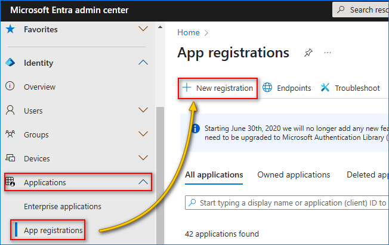

- In the **Name**, type in ***Microsoft 365 Usage Reports*** (or any name you prefer).

- In the **Supported account types**, select ***Accounts in this organizational directory only***.

- In the **Redirect URI (optional)**, select ***Web*** and type in `http://localhost`.

- Click on **Register**.

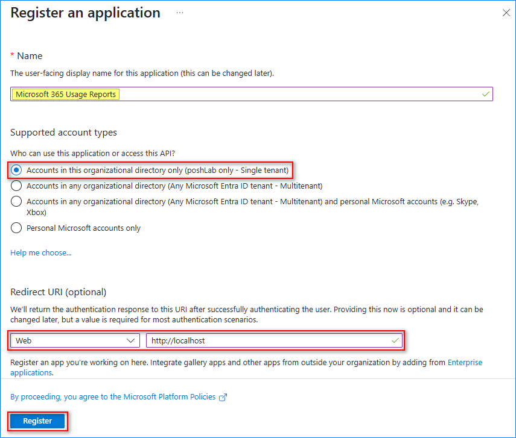

After the App has been registered, copy the **Application (client) ID** and **Directory (tenant) ID**.

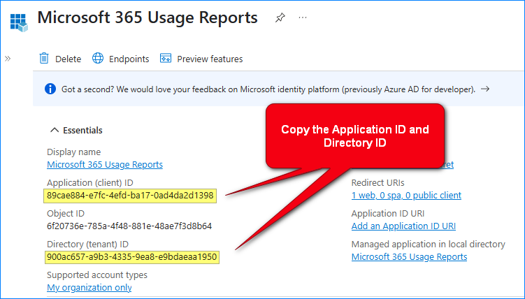

#### Adding the Required Microsoft Graph API Permissions

Go to **API Permissions** and click on the **Add a Permission** button.

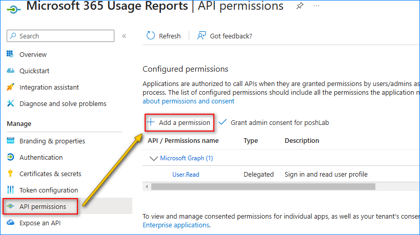

In the **Request API Permission**, select **Microsoft Graph API**.

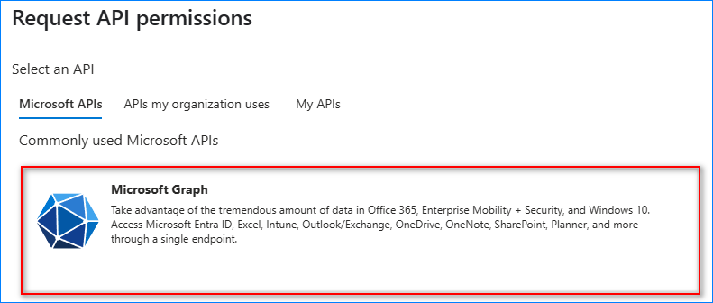

In **What type of permissions does your application require?** click on **Application**. From the list of permissions, search for and enable the following permissions.

- `Reports.Read.All`
- `Directory.Read.All`
- `Mail.Send`

Once you're done selecting the permissions, click on the **Add permissions** button.


#### Adding the Required Exchange Online API Permissions

Click **Add a permission**
Under the **Request API permisions**, click **APIs my organization uses**.
Search ***office 36 exchange online*** and click on the result.

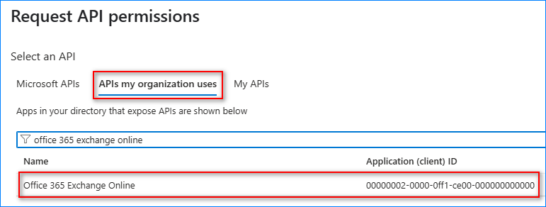

Search and enable the `Exchange.ManageAsApp` permission and click **Add permissions**.

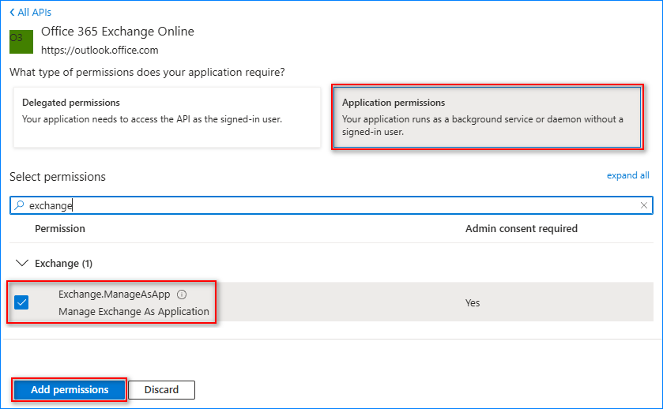

Now, remove the `User.Read` permission as it is not needed.

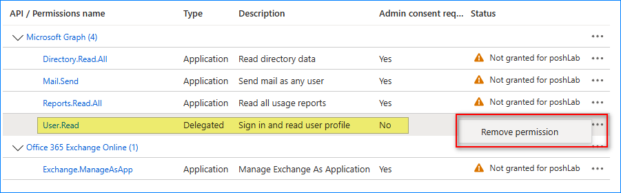

#### Creating and Uploading a Self-Signed Certificate

> *Note: You can use either a Certificate or a Client Secret for API authentication. This example shows you only how to create a certificate.*

Copy the code below and run it in PowerShell. The script will create a new self-signed certificate in the personal certificate store with a validity of five (5) years. Then, exports the DER-encoded `M36UsageReport.cer` file to the current working directory.

```PowerShell
# Create a self-sign certificate in the personal certificate store with 5-year validity.

$name = 'M36UsageReport'

$certSplat = @{
  Subject = "CN=$($name)"
  NotBefore = ((Get-Date).AddDays(-1))
  NotAfter = ((Get-Date).AddYears(5))
  CertStoreLocation = "Cert:\CurrentUser\My"
  Provider          = "Microsoft Enhanced RSA and AES Cryptographic Provider"
  HashAlgorithm     = "SHA256"
  KeySpec           = "KeyExchange"
}
$selfSignedCertificate = New-SelfSignedCertificate @certSplat

# Export the certificate (.CER)
Export-Certificate -Cert $selfSignedCertificate -FilePath "$($name).cer"
```

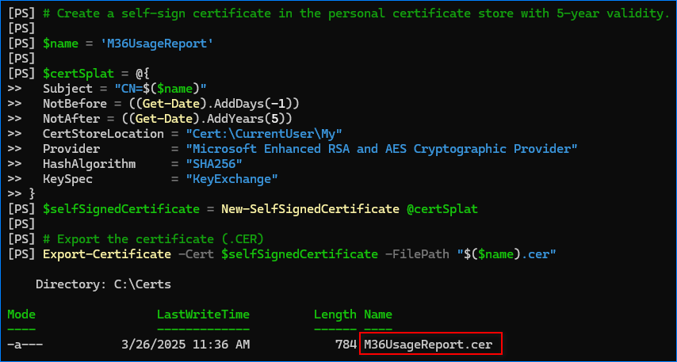

After running the code, you can see the new certificate is in the personal certificate store.

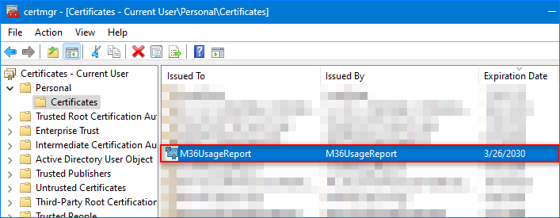<br>
The new self-signed certificate in the personal certificate store

> NOTE: If you plan to deploy the script to another machine, make sure to **export the PFX certificate** to file using the [PowerShell Export-PfxCertificate cmdlet](https://learn.microsoft.com/en-us/powershell/module/pki/export-pfxcertificate) or [MMC](https://knowledge.digicert.com/nl/nl/quovadis/ssl-certificates/ssl-general-topics/exporting-a-_pfx-using-mmc) and import it to another machine.

Now that you have the certificate file (.cer), the next step is to upload the certificate to the AzureAd App. Follow these next steps.

1. Go to **Certificates & secrets** and click on the **Upload certificate** button.
2. Click the browse button.
3. Locate the certificate file and click **Open**.
4. Click **Add**.

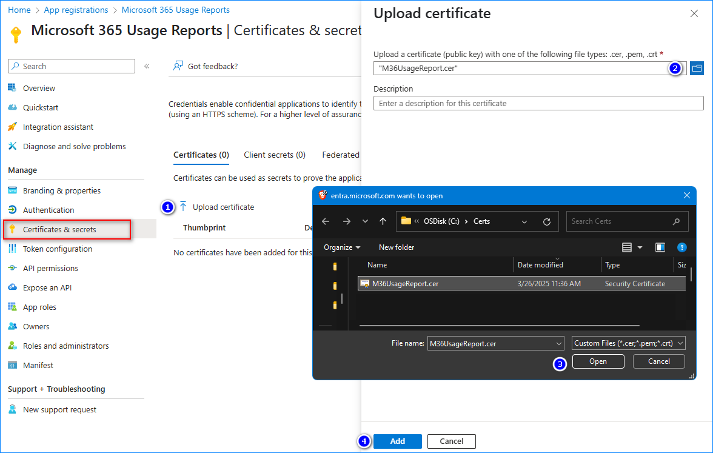<br>Uploading a certificate

You should now see the certificate was uploaded. Copy the **Thumbprint** value.

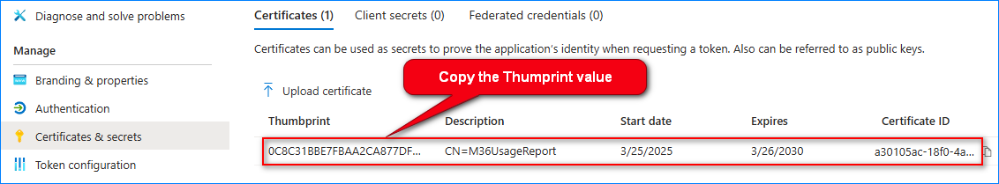<br>The certificate is uploaded

#### Granting Admin Consent

> *Note: Only a Global Admin, Application Administrator, and Privileged Role Administrator can grant consent on behalf of the Microsoft 365 Tenant to the application. If you do not have the proper rights, ask another administrator with sufficient role(s) to grant the consent.*

You should see that the new API permissions are added, but the status if ***Not granted for [tenant]***. To finish granting the permissions, click on the **Grant admin consent for [tenant]** button.

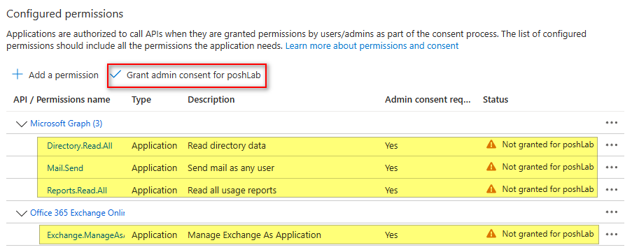

When asked to confirm, click on **Yes**.

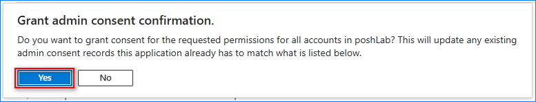

The API permissions status should change to **Granted for [tenant]**

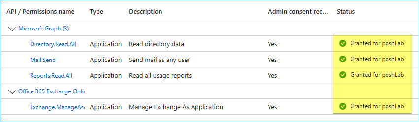

Now you should have the following details available:

- `Client ID`
- `Tenant ID`
- `Certificate Thumbprint`

#### Assigning the Exchange Administrator Role

This module also connects to the Exchange Online PowerShell to generate Exchange-related reports, like, the ATP detections, mail traffic summary, etc. And according to the official Microsoft guide to setting up [app-only authentication to Exchange Online](https://learn.microsoft.com/en-us/powershell/exchange/app-only-auth-powershell-v2?view=exchange-ps), the app's service principal must have an `Exchange Administrator` role.

Under the **Identity**, go to **Roles & admin**.
Search for the `Exchange Administrator` role and click the result.

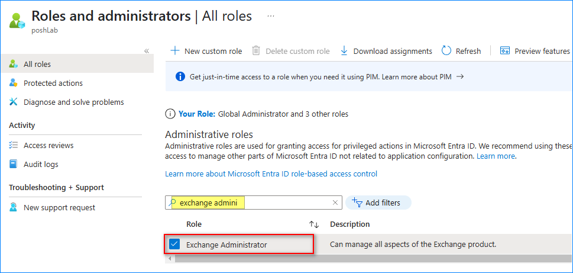

Click **Add assignments**

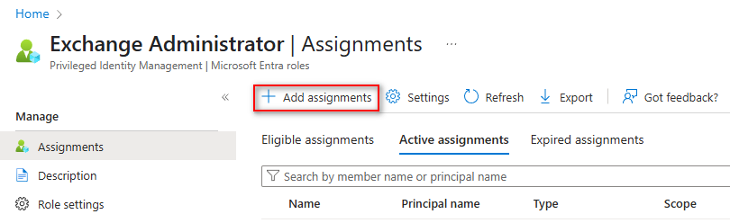

Click the **No members selected** link.

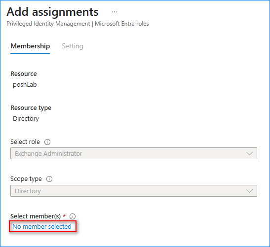

Search your app's name, click it on the list, and click **Select**.

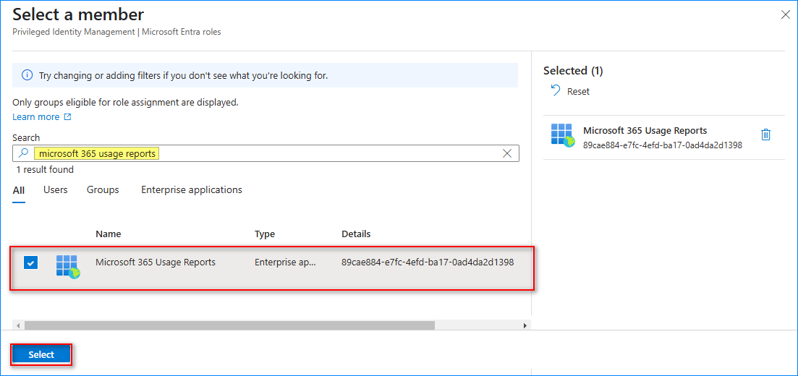

Click **Next**.

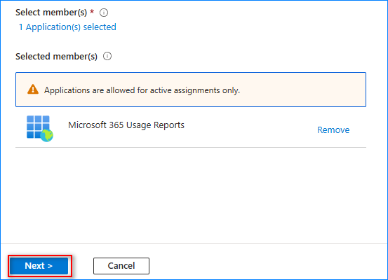

Select **Active**, enable **Permanently assigned**, type the justification text, and click **Assign**.

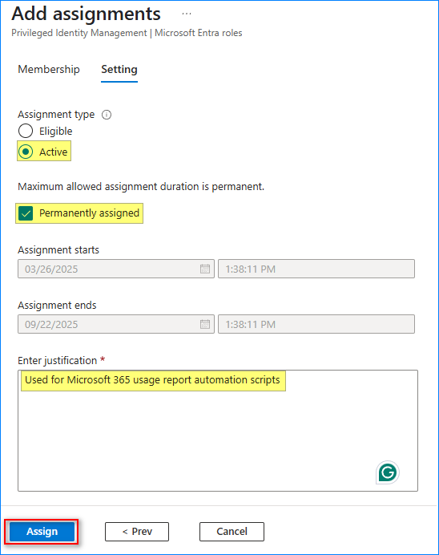

### Sample Report

#### Email

Below is an example of the HTML usage report sent as an email.

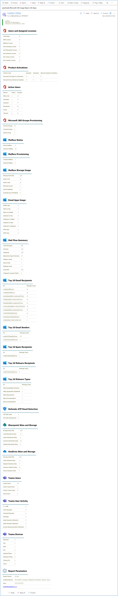

#### HTML File

The HTML file report is saved at `"$env:TEMP\M365UsageReport\<org-domain>\Microsoft_365_Usage_Report.HTML"`. Its contents appears exactly as the body of the email report above.

#### Raw Data CSV Files

The raw data CSV files are also found at `"$env:TEMP\M365UsageReport\<org-domain>"`.

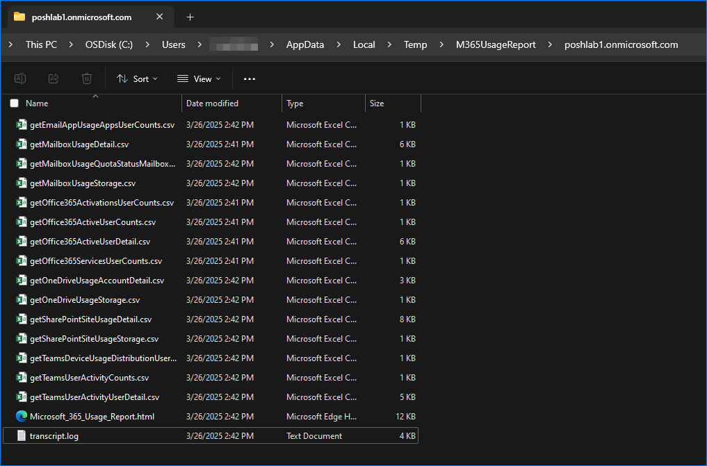
